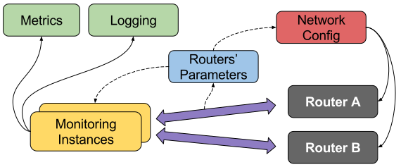
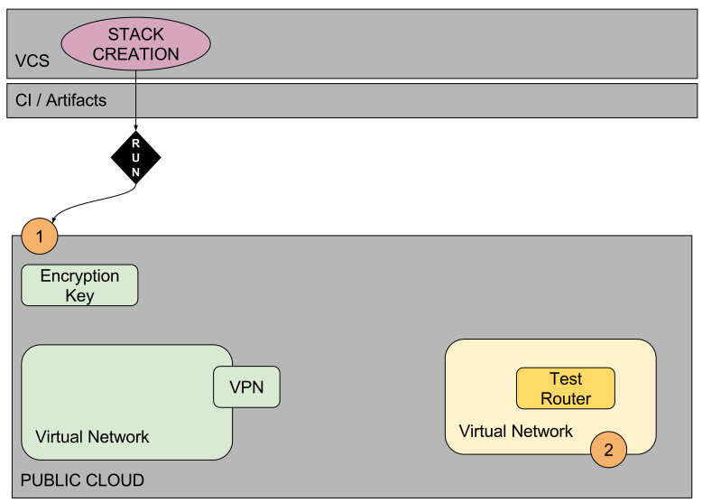
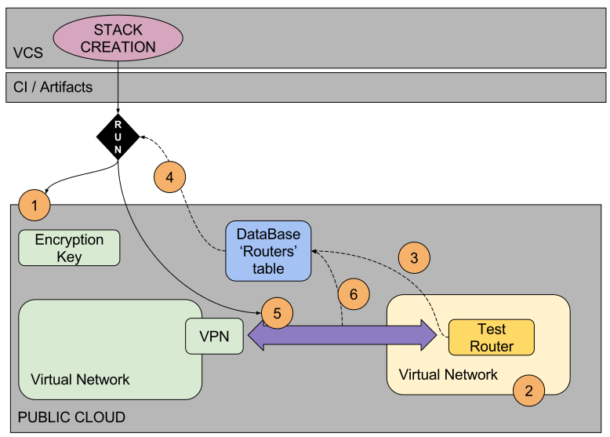
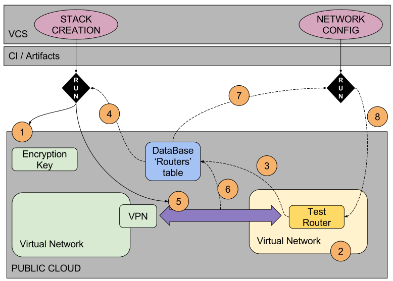
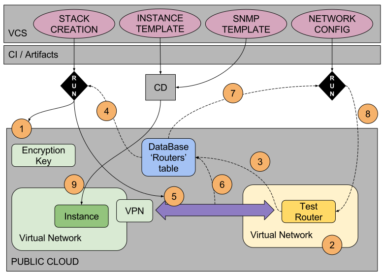
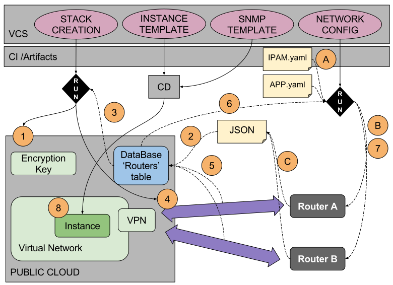

% IaC Network Ops
% 
% GORE19, April 6th, 2017

## Disclaimer


#

## Some Context

## About Me - _Christian Adell_

* **DevOps Network Engineer** at *Schibsted Media Group*
* Former **Network Engineer** at *CCMA / TV3*

```python
def how_to_get_in_contact(channel):
    username = 'chadell'
    if channel in ['linkedin', 'github']:
        return username
    elif channel == 'twitter':
        return "{}0".format(username)
    elif channel == 'email':
        return "{}@gmail.com".format(username)
    else:
        Raise ConnectionError('You will find me running in some mountain')
```    

## Schibsted Media Group


## Platform Edge Network Services


* What are we working on?

    * Edge Networking
    * DDoS Mitigation
    * DNS

* Credits:

    * **Valentin Gutierrez**
    * **Stein Ove Rosseland**

#

## Requirements

## Use-case
* Provide **<1.2ms** network latency to an specific Provider
* Peering in Amsterdam and Frankfurt
* Use a IaaS provider who provides the virtual routers
* Future new PoPs over other IaaS providers or On-premises

## What was expected from us?
* Network Configuration
    * High-availability, critical business operation **$$$**
    * No network engineers to operate it
    * DevOps teams behind, _"you build it, you run it"_
* Network Monitoring
    * Integrate with current SaaS monitoring solutions
        * Metrics
        * Logging
    
#

## Overall idea



#
 
## Let's meet our friends

## Dynamic Infrastructure

In our case, a Public Cloud, but it applies to whatever infrastructure being:

* **Programmable**: API, SDK
* **On-demand**: creation and destruction
* **Self-service**: you build it, you run it!
 
_i.e. OpenStack, Google Cloud, AWS, Azure_


## Version Control System

> **Enables cooperation and continous improvement**

* Changes traceability
* Rollback
* Correlation of changes of different elements
* Visibility
* Automatic trigger of later actions (testing, etc.)
 
_i.e. Git (GitHub, BitBucket), Subversion_


## Continous Integration

> **Verifies your work before getting burnt**

* Frequently integrating and testing all changes to a system as they are being developed

1. Install/Compile new code from VCS
2. Test it
    * Low-level: Unit testing
    * High/Mid-Level: Functional, Load, Stress testing
3. Deploy it to a Repository
    * i.e. Python Pypi, RPM package
 
_i.e. TravisCI, Jenkins, TeamCity_


## Continous Deployment

> **Automates provisioning in multiple environments**

0. From a source code in VCS
1. Configuration
    * trigger
2. Bake
    * Provider, Base OS
3. Deploy in a/multiple Dynamic Infrastructures
    * Account / Environment
    * Network, Capacity
    * Secrets and permissions
 
_i.e. Spinnaker, Jenkins_        

#
 
## Test Environment

## Provision Dynamic Infrastructure

{ width=80% }

## Dynamic infrastructure

```json
"Conditions": {
    "Resources": {
        "VyOsInstance": {
            "Properties": {
                "ImageId": {
                    "Fn::FindInMap": [
                        "RegionMap",
                        { "Ref": "AWS::Region" }, 
                        "AMI" ]
                },
                "InstanceType": "t2.micro",
                "KeyName": "whatever",
                "NetworkInterfaces": [
                    {
                        "DeviceIndex": "0",
                        "NetworkInterfaceId": { "Ref": "Eth0" }
                    }],
                "Tags": [{
                        "Key": "Name",
                        "Value": "edge-vyos-router"
                    }]
            },
            "Type": "AWS::EC2::Instance"
        }
    }
}
```


## Iterate on Dynamic Infrastructure

{ width=80% }

## Routers' database

```json
{
"fqdn": "router5.whatever.com",
 "public_ip": "198.51.0.1",
 "mgmt_ip": "10.1.1.5",
 "model": "cisco",
 "location": "Amsterdam",
 "user": "whatever",
 "auth_key": "whatever",
 "priv_key": "whatever",
 "auth_protocol": "usmHMACMD5AuthProtocol",
 "priv_protocol": "usmDESPrivProtocol",
 "oids": {
    "1.3.6.1.2.1.1.7": "sysServices",
    },
 "mibs": {
    "IF-MIB": {
        "table": "ifTable",
        "symbols": ["ifInOctets", "ifOutOctets"],
        "metric_tags": {
            "tag": "interface",
             "column": "ifDescr"}
        }
    }
}
```


## Provisioning network devices

{ width=80% }


## J2 Templates (per NOS)

```jinja
#  Monitoring config
set interfaces loopback lo address {{ router['mgmt_ip'] }}/32
set interfaces vti vti1 address {{ router['vpn_aws']['vti_ip']}}/30
set interfaces vti vti1 description 'VPC tunnel 1'
set interfaces vti vti1 mtu '1436'
set protocols static interface-route 10.1.136.0/21 next-hop-interface 'vti1'

# SNMPv3 config
set service snmp v3 view rootmib oid '1.3.6.1.2.1'
set service snmp v3 group Group1 seclevel 'priv'
set service snmp v3 group Group1 view 'rootmib'
set service snmp v3 user admin group 'Group1'
set service snmp v3 user admin auth plaintext-key {{ router['auth_key'] }}
set service snmp v3 user admin privacy plaintext-key {{ router['priv_key'] }}
```


## Final Test environment

{ width=80% }

## Generate snmp.yaml 
```jinja2
instances:


 - ip_address: {{ router.monitoring_ip }}
   enforce_mib_constraints: false
   user: {{ router.user }}
   authKey: {{ router.auth_key }}
   privKey: {{ router.priv_key }}
   authProtocol: {{ router.auth_protocol }}
   privProtocol: {{ router.priv_protocol }}
   timeout: 2
   tags:
       - {{ router.fqdn }}
       - {{ router.location }}
       - {{ router.model }}
   metrics:

       - OID: {{ oid }}
         name: {{ name }}

``` 

#

## Production environment

## { width=100% }

## IPAM.yaml

```yaml
# Interfaces configuration
interfaces:
  - name: 'bond1.193'
    parent: 'bond1'
    vlan: '193'
    ip_address: '172.16.0.18/29'
    priority: '200'
    ip_vrrp:
      - ip: '198.51.6.5/28'
# BGP Configuration
asn: 111
networks:
  - '198.51.0.0/24'
router_id: '10.155.12.88'
peers:
  - ip: '198.51.33.47'
    asn: 222
    med: False
    localpref: False
  - ip: '10.4.5.70'
    asn: 111
    multi_hop: 0
```

## APP.yaml

```yaml
groups:
  - address-group:
    name: 'STAFF-ACCESS'
    addresses:
      - '198.51.123.123'
firewall:
  - rule:
    source: 'STAFF-ACCESS'
    destination: 'EXPOSED-SERVERS'
    protocol: 'tcp'
    destination_port: '22'
    action: 'accept'
nat:
  - rule:
    internal_ip: '10.3.8.4'
    external_ip: '198.51.0.1'
```

## J2 Templates (per NOS)

```jinja
# BGP peerings


set protocols bgp {{ router['asn'] }} neighbor {{ peer.ip }} ebgp-multihop {{ peer.multi_hop }}


set protocols bgp {{ router['asn'] }} neighbor {{ peer.ip }} route-map export 'MED100'


set protocols bgp {{ router['asn'] }} neighbor {{ peer.ip }} route-map import 'SETLOCALPREF'

set protocols bgp {{ router['asn'] }} neighbor {{ peer.ip }} prefix-list export 'EXPORT-IP-RANGES'
set protocols bgp {{ router['asn'] }} neighbor {{ peer.ip }} remote-as {{ peer.asn }}
set protocols bgp {{ router['asn'] }} neighbor {{ peer.ip }} soft-reconfiguration 'inbound'

```


## Continous Validation

```python
def _validate_attributes(self, attrs):

    if not ipaddress.ip_address(attrs['public_ip']).is_global:
        log.error('[Router] public_ip (%s) is not a valid IPv4 address', attrs['public_ip'])
        raise ValueError

    if not ipaddress.ip_address(attrs['mgmt_ip']).is_private:
        log.error('[Router] mgmt_ip (%s) is not a valid IPv4 address', attrs['mgmt_ip'])
        raise ValueError

    if attrs.get('oids') is not None:
        if not isinstance(attrs['oids'], dict):
            log.error('[Router] invalid oids definition: %s', attrs['oids'])
            raise ValueError

        for oid, name in attrs.get('oids').iteritems():
            if not re.match("^1.3.6.1.(\d+.)*\d+$", oid):
                log.error('[Router] Oid (%s) is not in a valid format', oid)
                raise ValueError
    ...
```

#

## Lessons learned

* Don't have fear, there are friends willing to help out there!
* Learn from failures
* Start small, solve concrete issues (80-20)
* When everything is running, destroy it and recreate from scratch
* Test by default
* After some time, look back at your early code and LoL 

{ width=40% }

# 

## Next Steps

* Add new user-cases (templates, scenarios)
* Why not adopt a data model language (YANG)?
* Automatic configuration deployment -> DEV -> PRO
* Provide a seamless integration with developers
* More and more testing

#

## SDN meetup - Friday 14:30

{ width=100% }

# 

## Q/A


