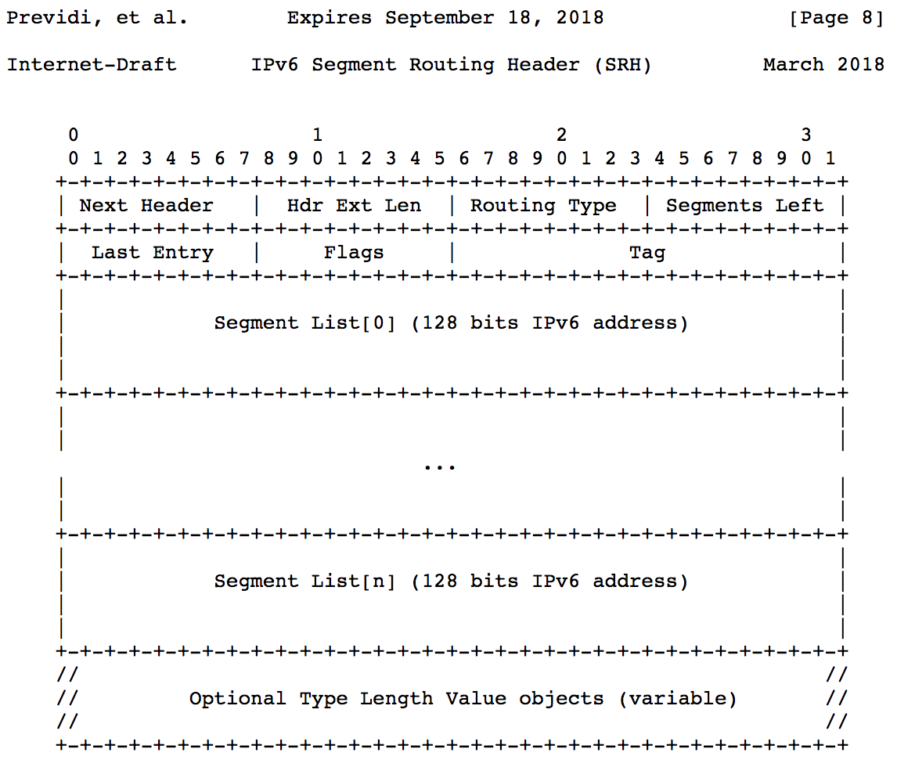
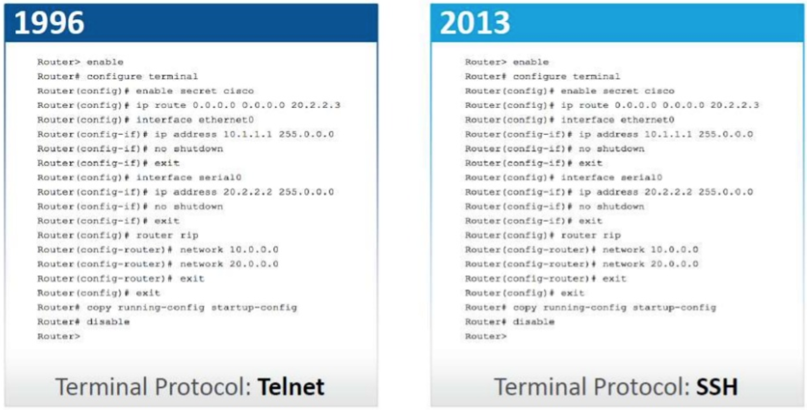

% One Network to rule them all
% 10-11 Mar, DevOps.Barcelona
% Christian Adell @chadell0 { width=5% }

<!-- 
Hello everyone!

Wow, I will start thanking you very much for being here, the last session of the day... and about NETWORKING.

I have to confess you that when I submitted this talks to the CFP I was a bit unsure about how to organize it, because, as you may have experienced, networking is not the disciple where devops culture has had more impact on so far.

But, on the other side I felt that explaining my journey from a traditional network engineer to adopt a devops mindset, could help you on your own way. My name is Christian Adell and I have been working as a Devops/Network engineer in Schibsted for more than 2 years.

Before starting this talk, let me understand better how many of you are involved in networking day-to-day,  with a simple poll:

* who works on networking challenges in your daily work? and who likes it?

mmm, not bad, I hope you, at least some of you, will enjoy this story...
-->

#

## is this about networking? 😱🤯🤮🤢

<!-- 
... but also for the rest, who probably felt like these emojis when they saw this presentation abstract.

So, what is this gonna be about?
-->

##

{ width=75% }
<!-- 
... we could learn about some cool stuff about using Segment Routing with IPv6 to define network functions service chain...
but don't worry!!! this talk is not about a specific network protocol and its headers...
even knowing this details is useful to improve our applications' performance
-->

##

<!-- 
we could also talk about the "dramatic" improvement in network operations for the last 20 years (ironic)...
-->

## SDN, Network Programmability, Intent-based, NetOps? 🤔

<!-- 
... not joking, the networking area finally started moving to a devops approach and a lot of examples of automation is appearing these days. Here in Barcelona we are following in the "SDN and Network Programmability meetup" where you will be welcome.

But, what is this presentation about?
-->

##

{ width=75% }

<!-- 
...this presentation is about a LOVE story between network and software engineers. 

How we worked together to achieve common goals, improving how developers use network resources.

Forget about the famous senteces, "it works for me", "it works in my laptop". Now, we are part of the same teams and we understand better each point of view.

In this presentation I will show you the process/decisions we took at Schibsted to build a service to abstract networking and the result we got (expect a demo!)
-->

<!-- Timings
Welcome: 5, 4
The Problem: 7, 5
First try: 6, 5
Service: 10, 13
Demo: 8, 7
Wrap-up: 4, 2
Total: 40, 37
-->